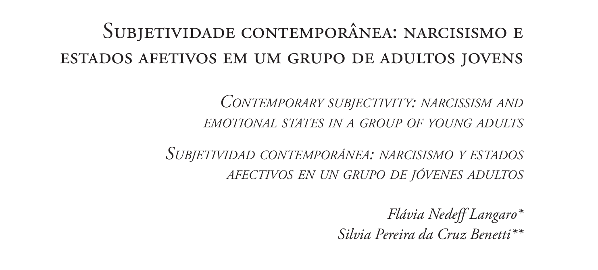
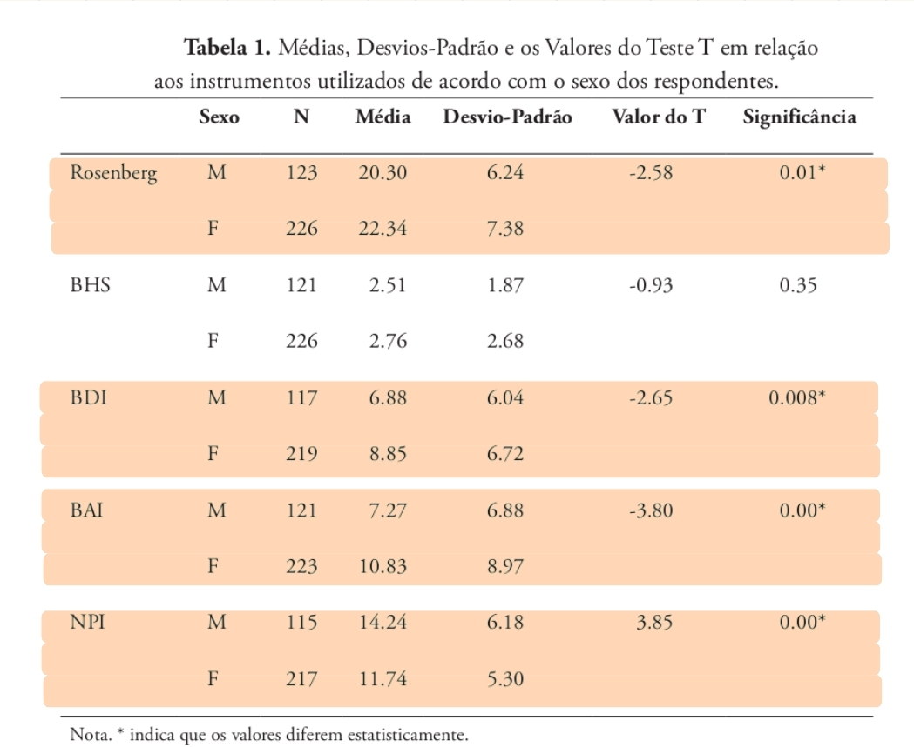
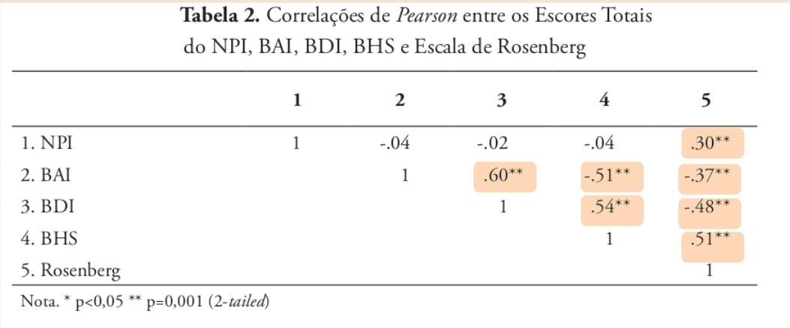
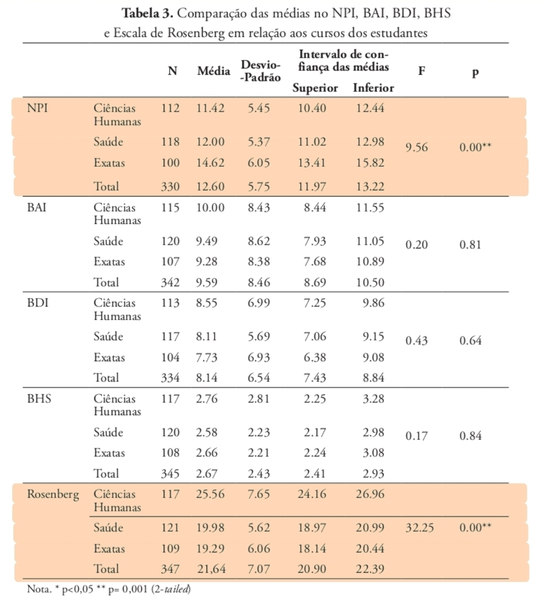
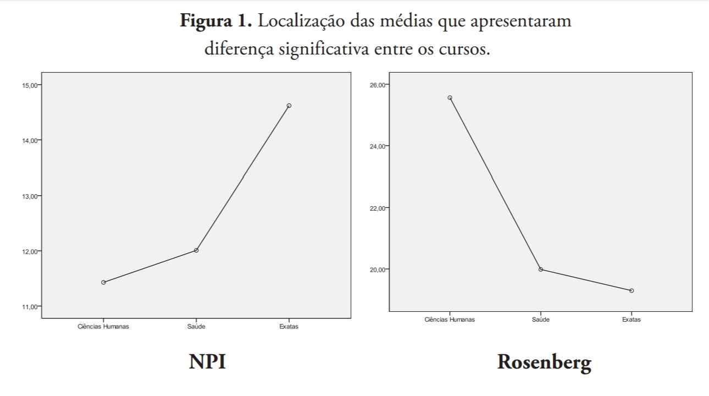

# Introdução: 

## Artigo e autoras:

Psicologia Clinica (PUC-Rio), 2014

## Motivação:

::: box-blue
- Transformações da sociedadede contemporânea que impactam a subjetividade:
  - Processo de globalização, avanços na industrialização, dependência da informática e da realidade virtual.
 
- Aumentos de quadros associados a narcisismo, depressão, ansiedade, desesperança
- Necessidade de investigação quantitativa dessas relações em jovens universitários.
:::

## Objetivos:

::: box-orange

- Identificar as características narcísicas de personalidade em jovens adultos universitários e verificar suas associações com:
  - Autoestima;
  - Sintomas de ansiedade;
  - Sintomas de depressão;
  - Nível de desesperança.

:::

## Amostra:

::: box-gray
- 350 jovens adultos universitários (35,4% homens, 64,6% mulheres).
- 18 a 30 anos;
- Cursos das áreas:
  - Humanas;
  - Exatas;
  - Saúde.
- Coleta dos dados sociodemográficos e administração dos instrumentos em sala de aula por meio de questionários padronizados.

:::

## Instrumentos:

| Instrumento | O que mede                  | Direção do escore | $\boldsymbol{\alpha}$ |
|:-----------:|:---------------------------:|:----------------:|:----:|
| <b>BAI</b> Inventário de Ansiedade de Beck | Intensidade da **ansiedade**| $\uparrow$ escore = $\uparrow$ ansiedade | 0,88 |
| <b>BHS</b> Escala de Desesperança de Beck | Grau de **desesperança**    | $\uparrow$ escore = $\uparrow$ desesperança | 0,81 |
| <b>BDI-II</b> Inventário de Depressão de Beck-II | Intensidade da **depressão**| $\uparrow$ escore = $\uparrow$ depressão | 0,81 |
| <b>Rosenberg</b> Escala de Rosenberg | **Autoestima** global       | $\uparrow$ escore = $\uparrow$ autoestima | 0,73 |
| <b>NPI</b> Inventário de Personalidade Narcisista | Traços de **Narcisismo**    | $\uparrow$ escore = $\uparrow$ narcisismo | 0,79 |

#  Metodologia estatística:

## Variáveis analisadas:

:::: columns

::: {.column width="45%"}

::: box-blue
- **Variável de interesse:**
  - Escore de narcisismo (NPI)
  - Variável quantitativa continua
  
:::
  
:::

:::{.column width="10%"}

:::

::: {.column width="45%"}

::: box-blue

- **Fatores de exposição:**

| Variável  | Tipo                 |
|-----------|----------------------|
| Rosenberg | Quantitativa         |
| BAI       | Quantitativa         |
| BHS       | Quantitativa         |
| BDI-II    | Quantitativa         |
| Sexo      | Qualitativa binária  |
| Curso     | Qualitativa nominal  |

:::

:::

::::

## Testes aplicados:

::: box-blue

- **Teste t de Student**

:::

 

::: box-gray

- **Correlação de Pearson**

:::

 

::: box-orange

- **ANOVA**

:::

# Resultados:

## T-teste:

::: {style="max-height: 600px; overflow-y: auto;"}

{fig-align="center" width=100%}

:::

## Pearson: 

{fig-align="center" width=100%}

## ANOVA:

::: {.panel-tabset}

### Tabela

::: {style="max-height: 525px; overflow-y: auto;"}

{fig-align="center" width=100%}

:::

### Figura

{fig-align="center" height=500px}

:::

## Resultados: {style="font-size: 0.75em;"}

::: box-blue

- **Homens** com maior **narcisismo**;

- **Mulheres** com maior **autoestima**, **ansiedade** e **depressão**;

:::

 

:::: columns

::: {.column width="5%"}

:::

::: {.column width="40%"}

::: box-gray

- Correlações significativas **positivas**: 

  - Narcisismo x Autoestima;
  - Ansiedade x Depressão;
  - Depressão x Desesperança;
  - Desesperança x Autoestima. **\***

:::

:::

::: {.column width="10%"}

:::

::: {.column width="40%"}

::: box-gray

- Correlações significativas **negativas**:
  - Autoestima x Depressão;
  - Autoestima x Ansiedade;
  - Ansiedade x Depressão.

:::

:::

::: {.column width="5%"}

:::

::::

 

::: box-orange

- **Narcisismo** por curso: **Maior** média em **Exatas** e menor em Humanas

- **Autoestima** por curso: **Maior** média em **Humanas** e menor em Exatas

::: 

# Conclusão:

## Principais Achados:

:::: columns

::: {.column width="38%" }

::: box-gray

- O narcisismo nesta amostra é predominantemente **não patológico** e apresenta caráter **adaptativo**;

 

- Observou-se um **padrão de correlação entre variáveis emocionais**, com associação entre ansiedade, depressão e desesperança;

:::

:::

::: {.column width="2%"}

::: 

::: {.column width="60%"}

::: box-blue

- Mulheres apresentam maior **vulnerabilidade emocional** (maiores níveis de ansiedade e depressão);

::: 

 

::: box-orange

- A escolha do curso parece refletir características de personalidade:
  - **Humanas**: mais cooperativos; ($\uparrow$ autoestima; $\downarrow$ narcisismo)
  
  - **Exatas**: mais competitivos. ($\downarrow$ autoestima; $\uparrow$ narcisismo)

:::

::: 

::::

## Importância do Teste de Associação:

::: box-blue

- **Teste t de Student**: Identificou diferenças entre os sexos  

:::

 

::: box-gray

- **Correlação de Pearson**: Evidenciou associações entre variáveis emocionais  

:::

 

::: box-orange

- **ANOVA**: Diferenciou perfis por área de curso  

:::

## Contribuição para a Sociedade:

::: box-blue

- Oferece subsídios para a prática clínica no tratamento das "patologias do vazio";

- Auxilia instituições de ensino a identificar grupos que necessitam de suporte psicológico (ex: mulheres e ansiedade);

- Fornece dados sobre a subjetividade do jovem brasileiro em relação a padrões globais.

:::

# Fim. {.unnumbered .final-slide }
