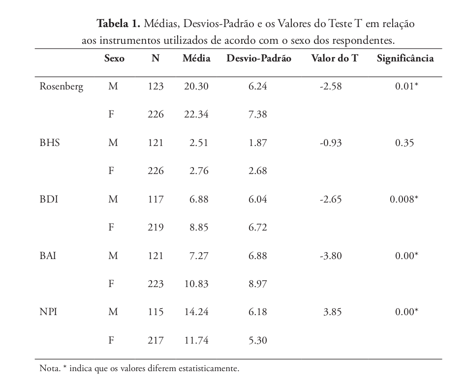
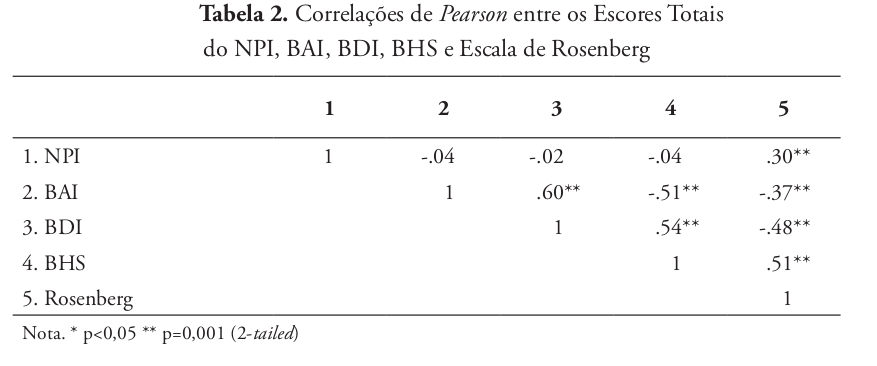
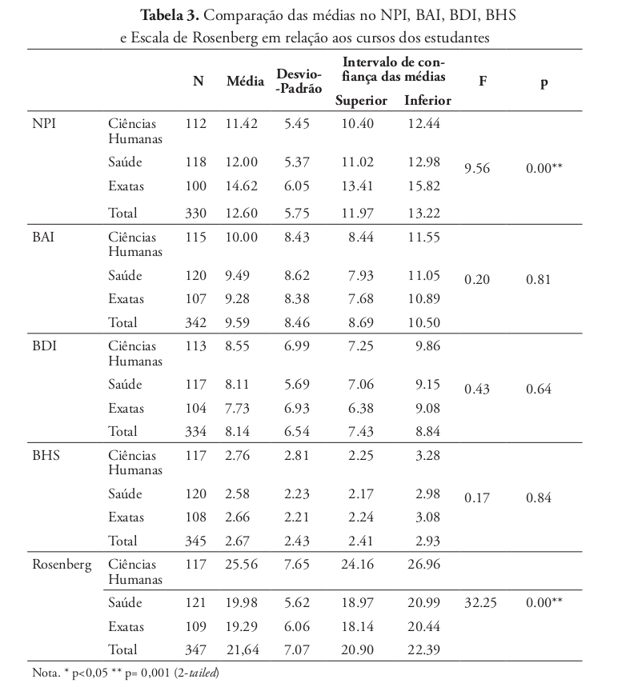

# Introdução: 

## Artigo e autoras:

Psicologia Clinica (PUC-Rio), 2014

## Motivação:

::: box-blue
- Transformações da sociedadede contemporânea que impactam a subjetividade:
  - Processo de globalização, avanços na industrialização, dependência da informática e da realidade virtual.
 
- Aumentos de quadros associados a narcisismo, depressão, ansiedade, desesperança
- Necessidade de investigação quantitativa dessas relações em jovens universitários.
:::

## Objetivos:

::: box-yellow

- Identificar as características narcísicas de personalidade em jovens adultos universitários e verificar suas associações com:
  - Autoestima;
  - Sintomas de ansiedade;
  - Sintomas de depressão;
  - Nível de desesperança.

:::

## Amostra:

::: box-blue
- 350 jovens adultos universitários (35,4% homens, 64,6% mulheres).
- 18 a 30 anos;
- Cursos das áreas:
  - Humanas;
  - Exatas;
  - Saúde.
- Coleta dos dados sociodemográficos e administração dos instrumentos em sala de aula por meio de questionários padronizados.

:::

## Instrumentos:

| Instrumento                               | O que mede                                            | Interpretação do escore                        | Alfa |
|--------------------------------------------|--------------------------------------------------------|-------------------------------------------------|-------|
| BAI- Inventário de Ansiedade de Beck       | Intensidade de sintomas de ansiedade                   | Maior escore   $\rightarrow$ maior ansiedade    | 0,88  |
| BHS-Escala de Desesperança de Beck         | Grau de desesperança / pessimismo em relação ao futuro | Maior escore   $\rightarrow$ maior desesperança | 0,81  |
| BDI-II-Inventário de Depressão de Beck-II  | intensidade de sintomas depressivos                    | Maior escore   $\rightarrow$ maior autoestima   | 0,81  |
| Rosenberg-Escala de Rosenberg              | autoestima global                                      | Maior escore   $\rightarrow$ maior autoestima   | 0,73  |
| NPI-Inventário de Personalidade Narcisista | Traços de personalidade narcisista                     | Maior escore   $\rightarrow$ maior narcisismo   | 0,79  |

#  Metodologia estatística:

## Variáveis analisadas:

:::: columns

::: {.column width="45%"}

::: box-blue
- **Desfecho:**
  - Escore de narcisismo (NPI)
  - Variável quantitativa continua
  
:::
  
:::

:::{.column width="10%"}

:::

::: {.column width="45%"}

::: box-blue

- **Fatores de exposição:**

| Variável  | Tipo                 |
|-----------|----------------------|
| Rosenberg | Quantitativa         |
| BAI       | Quantitativa         |
| BHS       | Quantitativa         |
| BDI-II    | Quantitativa         |
| Sexo      | Qualitativa binária  |
| Curso     | Qualitativa nominal  |

:::

:::

::::

## Testes aplicados:
::: box-blue
- Teste T;
- Correlações de Pearson;
- Anova.

:::

# Tabelas:

## Tabela 1:

::: {style="max-height: 600px; overflow-y: auto;"}

{fig-align="center" width=100%}

:::

## Tabela 2: 

{fig-align="center" width=100%}

## Tabela 3:

::: {style="max-height: 600px; overflow-y: auto;sf"}

{fig-align="center" width=100%}

:::

## Resultados:

::: box-blue

- Narcisismo brasileiro (12,60) é inferior ao de jovens americanos (17,62);

- Narcisismo associado a dimensões saudáveis: liderança, autoridade e autossuficiência;

- Não houve correlação entre narcisismo e sintomas patológicos de ansiedade ou depressão.

:::

# Conclusão:

## Principais Achados:

::: box-blue

- O narcisismo nesta amostra é predominantemente não-patológico e adaptativo;

- Mulheres apresentam maior vulnerabilidade emocional (ansiedade e depressão);

- A escolha do curso reflete a personalidade: Humanas busca cooperação; Exatas, aspectos mais competitivos

:::

## Importância do Teste de Associação:

::: box-blue

- Validou que o narcisismo pode estar ligado a um maior valor próprio e assertividade;

- Permitiu distinguir cientificamente traços de personalidade de sintomas clínicos.

:::

## Contribuição para a Sociedade:

::: box-blue

- Oferece subsídios para a prática clínica no tratamento das "patologias do vazio";

- Auxilia instituições de ensino a identificar grupos que necessitam de suporte psicológico (ex: mulheres e ansiedade);

- Fornece dados sobre a subjetividade do jovem brasileiro em relação a padrões globais.

:::

# Fim. {.unnumbered}
