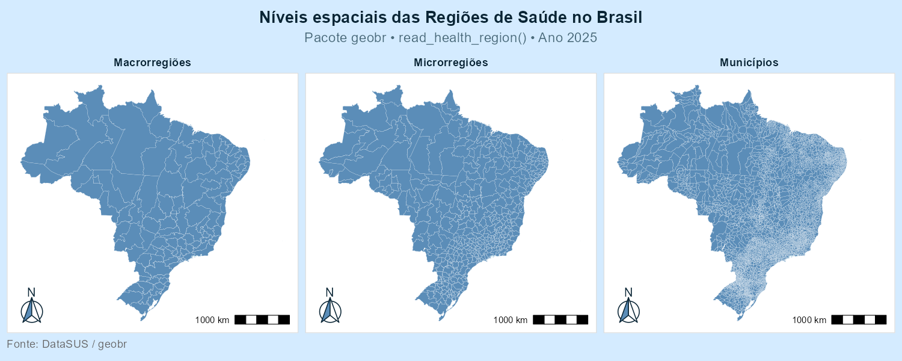
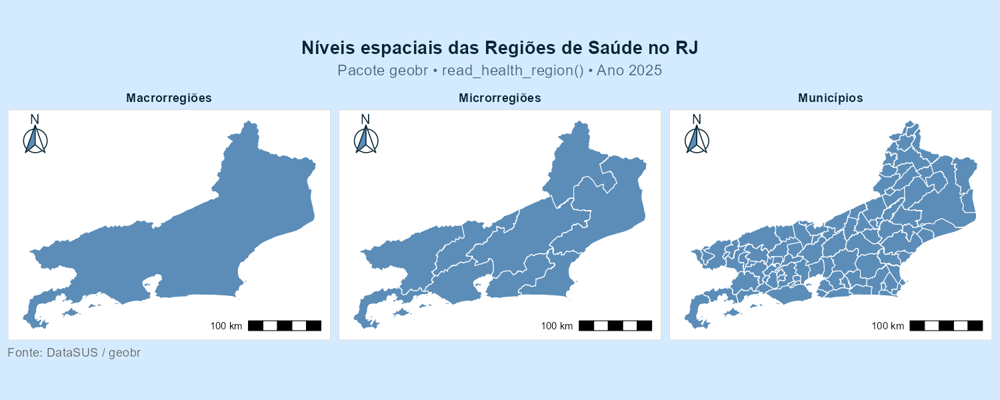
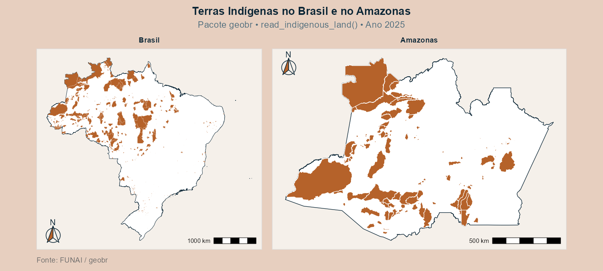

# Introdução

## Introdução

:::: {.columns}

::: {.column width="49%"}
<div style="background:#e6f2fb; border:1.5px solid #1a6fa8; border-radius:12px; padding:1.25rem 1.1rem; display:flex; flex-direction:column; gap:0; font-size:0.7em;">
<div style="display:flex; justify-content:center; width:100%;">

</div>

### Regiões de Saúde {style="font-size:1.3em; font-weight:700; color:#0a2535; margin:0 0 10px 0;"}

---

<div style="display:flex; gap:8px; align-items:flex-start; padding:3px 0;">
<span style="color:#1a6fa8; margin-top:2px;">🗺️</span>
<div>
<div style="font-size:0.85em; font-weight:700; text-transform:uppercase; letter-spacing:0.07em; color:#4a6a7a; margin-bottom:2px;">O que representa</div>
<div>Regiões de Saúde e Macrorregiões de Saúde utilizadas no planejamento regional e estadual dos serviços de saúde.</div>
</div>
</div>

---

<div style="display:flex; gap:8px; align-items:flex-start; padding:3px 0;">
<span style="color:#1a6fa8; margin-top:2px;">🎯</span>
<div>
<div style="font-size:0.85em; font-weight:700; text-transform:uppercase; letter-spacing:0.07em; color:#4a6a7a; margin-bottom:2px;">Objetivo</div>
<div>Representar a organização territorial utilizada pelo Sistema Único de Saúde (SUS).</div>
</div>
</div>

---

<div style="display:flex; gap:8px; align-items:flex-start; padding:3px 0;">
<span style="color:#1a6fa8; margin-top:2px;">💡</span>
<div>
<div style="font-size:0.85em; font-weight:700; text-transform:uppercase; letter-spacing:0.07em; color:#4a6a7a; margin-bottom:2px;">Aplicações</div>
<div style="display:flex; flex-wrap:wrap; gap:3px; margin-top:2px; max-width:520px;">
<span style="flex:0 0 calc(50% - 3px); font-size:0.85em; padding:1px 7px; border-radius:99px; font-weight:500; background:rgba(26,111,168,0.12); color:#1a4a62; border:0.5px solid rgba(26,111,168,0.3);">Planejamento hospitalar</span>
<span style="flex:0 0 calc(50% - 3px); font-size:0.85em; padding:1px 7px; border-radius:99px; font-weight:500; background:rgba(26,111,168,0.12); color:#1a4a62; border:0.5px solid rgba(26,111,168,0.3);">Organização da rede SUS</span>


<span style="flex:0 0 calc(50% - 3px); font-size:0.85em; padding:1px 7px; border-radius:99px; font-weight:500; background:rgba(26,111,168,0.12); color:#1a4a62; border:0.5px solid rgba(26,111,168,0.3);">Regionalização dos serviços de saúde</span>
</div>
</div>
</div>

---

<div style="display:flex; gap:8px; align-items:flex-start; padding:5px 0;">
<span style="color:#1a6fa8; margin-top:2px;">🏥</span>
<div>
<div style="font-size:0.85em; font-weight:700; text-transform:uppercase; letter-spacing:0.07em; color:#4a6a7a; margin-bottom:2px;">Órgão responsável</div>
<div>DataSUS - Ministério da Saúde</div>
</div>
</div>

---

<div style="display:flex; gap:8px; align-items:flex-start; padding:5px 0;">
<span style="color:#1a6fa8; margin-top:2px;">🌐</span>
<div>
<div style="font-size:0.85em; font-weight:700; text-transform:uppercase; letter-spacing:0.07em; color:#4a6a7a; margin-bottom:2px;">Nível territorial</div>
<div>Municípios · Regiões de Saúde · Macrorregiões de Saúde</div>
</div>
</div>

</div>
:::

::: {.column width="2%"}

:::

::: {.column width="49%"}
<div style="background:#faf0e8; border:1.5px solid #b5622a; border-radius:12px; padding:1.25rem 1.1rem; display:flex; flex-direction:column; gap:0; font-size:0.7em;">

<div style="display:flex; justify-content:center; width:100%;">
</div>

### Terras Indígenas {style="font-size:1.3em; font-weight:700; color:#0a2535; margin:0 0 10px 0;"}

---

<div style="display:flex; gap:8px; align-items:flex-start; padding:3px 0;">
<span style="color:#b5622a; margin-top:2px;">🗺️</span>
<div>
<div style="font-size:0.85em; font-weight:700; text-transform:uppercase; letter-spacing:0.07em; color:#4a6a7a; margin-bottom:2px;">O que representa</div>
<div>Terras Indígenas brasileiras em diferentes estágios de demarcação.</div>
</div>
</div>

---

<div style="display:flex; gap:8px; align-items:flex-start; padding:5px 0;">
<span style="color:#b5622a; margin-top:2px;">🎯</span>
<div>
<div style="font-size:0.85em; font-weight:700; text-transform:uppercase; letter-spacing:0.07em; color:#4a6a7a; margin-bottom:2px;">Objetivo</div>
<div>Representar espacialmente os territórios indígenas oficialmente reconhecidos.</div>
</div>
</div>

---

<div style="display:flex; gap:8px; align-items:flex-start; padding:3px 0;">
<span style="color:#1a6fa8; margin-top:2px;">💡</span>
<div>
<div style="font-size:0.85em; font-weight:700; text-transform:uppercase; letter-spacing:0.07em; color:#4a6a7a; margin-bottom:2px;">Aplicações</div>
<div style="display:flex; flex-wrap:wrap; gap:3px; margin-top:2px; max-width:520px;">
<span style="flex:0 0 calc(50% - 3px); font-size:0.85em; padding:1px 7px; border-radius:99px; font-weight:500; background:rgba(181,98,42,0.1); color:#7a3e15; border:0.5px solid rgba(181,98,42,0.3);">Políticas indigenistas</span>
<span style="flex:0 0 calc(50% - 3px); font-size:0.85em; padding:1px 7px; border-radius:99px; font-weight:500; background:rgba(181,98,42,0.1); color:#7a3e15; border:0.5px solid rgba(181,98,42,0.3);">Sobreposição com biomas</span>


<span style="flex:0 0 calc(50% - 3px); font-size:0.85em; padding:1px 7px; border-radius:99px; font-weight:500; background:rgba(181,98,42,0.1); color:#7a3e15; border:0.5px solid rgba(181,98,42,0.3);">Conservação ambiental</span>
</div>
</div>
</div>

---

<div style="display:flex; gap:8px; align-items:flex-start; padding:5px 0;">
<span style="color:#b5622a; margin-top:2px;">🏛️</span>
<div>
<div style="font-size:0.85em; font-weight:700; text-transform:uppercase; letter-spacing:0.07em; color:#4a6a7a; margin-bottom:2px;">Órgão responsável</div>
<div>FUNAI — Fundação Nacional dos Povos Indígenas</div>
</div>
</div>

---

<div style="display:flex; gap:8px; align-items:flex-start; padding:5px 0;">
<span style="color:#b5622a; margin-top:2px;">🌐</span>
<div>
<div style="font-size:0.85em; font-weight:700; text-transform:uppercase; letter-spacing:0.07em; color:#4a6a7a; margin-bottom:2px;">Nível territorial</div>
<div>Nacional</div>
</div>
</div>

</div>
:::

::::

# Explorando as Funções

## Funções

:::: {.columns}

::: {.column width="49%"}

<div style="background:#e6f2fb; border:1.5px solid #1a6fa8; border-radius:12px; padding:0.75rem 0.9rem; display:flex; flex-direction:column; gap:10px; font-size:0.6em;">

<div style="display:flex; align-items:center; justify-content:left; gap:10px;">

<h3 style="font-size:1.3em; font-weight:700; color:#0a2535; margin:0;">
2.1.1 Regiões de Saúde
</h3>

<span style="font-family:'Courier New',monospace; font-size:0.95em; font-weight:700; padding:3px 8px; border-radius:5px; background:#cce7ff; color:#1a6fa8; white-space:nowrap;">
`read_health_region()`
</span>

</div>

<div style="display:flex; gap:8px; align-items:flex-start; padding:3px 0;">

<span style="color:#1a6fa8; margin-top:2px;">⚙️️</span>

<div>

<div style="font-size:0.85em; font-weight:700; text-transform:uppercase; letter-spacing:0.07em; color:#4a6a7a; margin-bottom:4px;">
Argumentos
</div>

<div style="display:flex; flex-wrap:wrap; gap:4px; margin-bottom:4px;">

<span style="font-size:0.85em; padding:1px 7px; border-radius:99px; font-weight:500; background:rgba(26,111,168,0.12); color:#1a4a62; border:2.5px solid #b08d1a;">`year`</span>

<span style="font-size:0.85em; padding:1px 7px; border-radius:99px; font-weight:500; background:rgba(26,111,168,0.12); color:#1a4a62; border:2.5px solid #b08d1a;">`code_state`</span>

<span style="font-size:0.85em; padding:1px 7px; border-radius:99px; font-weight:500; background:rgba(26,111,168,0.12); color:#1a4a62; border:2.5px solid #b08d1a;">`geometry_level`</span>

<span style="font-size:0.85em; padding:1px 7px; border-radius:99px; font-weight:500; background:rgba(26,111,168,0.12); color:#1a4a62; border:2.5px solid #b08d1a;">`simplified`</span>

</div>
<div style="display:flex; flex-wrap:wrap; gap:4px;">

<span style="font-size:0.85em; padding:1px 7px; border-radius:99px; font-weight:500; background:rgba(26,111,168,0.12); color:#1a4a62; border:0.5px solid rgba(26,111,168,0.3);">`output`</span>

<span style="font-size:0.85em; padding:1px 7px; border-radius:99px; font-weight:500; background:rgba(26,111,168,0.12); color:#1a4a62; border:0.5px solid rgba(26,111,168,0.3);">`showProgress`</span>

<span style="font-size:0.85em; padding:1px 7px; border-radius:99px; font-weight:500; background:rgba(26,111,168,0.12); color:#1a4a62; border:0.5px solid rgba(26,111,168,0.3);">`cache`</span>

<span style="font-size:0.85em; padding:1px 7px; border-radius:99px; font-weight:500; background:rgba(26,111,168,0.12); color:#1a4a62; border:0.5px solid rgba(26,111,168,0.3);">`verbose`</span>

</div>
</div>
</div>

<!-- ANOS -->

<div style="display:flex; gap:8px; align-items:flex-start; padding:3px 0;">

<span style="color:#1a6fa8; margin-top:2px;">📅</span>

<div style="width:100%;">

<div style="font-size:0.85em; font-weight:700; text-transform:uppercase; letter-spacing:0.07em; color:#4a6a7a; margin-bottom:6px;">
Anos disponíveis
</div>

<div style="display:flex; align-items:center; flex-wrap:wrap; gap:4px; font-size:0.8em;">

<span style="font-weight:700; color:#1a4a62;">1991</span>
<span style="color:#7aa7c7;">—</span>

<span style="font-weight:700; color:#1a4a62;">1994</span>
<span style="color:#7aa7c7;">—</span>

<span style="font-weight:700; color:#1a4a62;">1997</span>
<span style="color:#7aa7c7;">—</span>

<span style="font-weight:700; color:#1a4a62;">2001</span>
<span style="color:#7aa7c7;">—</span>

<span style="font-weight:700; color:#1a4a62;">2005</span>
<span style="color:#7aa7c7;">—</span>

<span style="font-weight:700; color:#1a4a62;">2013</span>
<span style="color:#7aa7c7;">—</span>

<span style="font-weight:700; color:#1a4a62;">2023</span>
<span style="color:#7aa7c7;">—</span>

<span style="font-weight:700; color:#1a4a62;">2024</span>
<span style="color:#7aa7c7;">—</span>

<span style="font-weight:700; color:#1a4a62;">2025</span>

</div>
</div>
</div>

:::: {.columns}

::: {.column width="50%"}

<div style="display:flex; gap:8px; align-items:flex-start; padding:3px 0;">

<span style="color:#1a6fa8; margin-top:2px;">📐</span>

<div>

<div style="font-size:0.85em; font-weight:700; text-transform:uppercase; letter-spacing:0.07em; color:#4a6a7a; margin-bottom:2px;">
Tipo de geometria
</div>

POLYGON / MULTIPOLYGON

</div>
</div>

:::

::: {.column width="50%"}

<div style="display:flex; gap:8px; align-items:flex-start; padding:3px 0;">

<span style="color:#1a6fa8; margin-top:2px;">🧱</span>

<div>

<div style="font-size:0.85em; font-weight:700; text-transform:uppercase; letter-spacing:0.07em; color:#4a6a7a; margin-bottom:2px;">
Estrutura
</div>

Objeto espacial `sf`

</div>
</div>

:::

::::

<!-- COLUNAS -->

<div style="display:flex; gap:8px; align-items:flex-start; padding:3px 0;">

<span style="color:#1a6fa8; margin-top:2px;">🗂️</span>

<div style="width:100%;">

<div style="font-size:0.85em; font-weight:700; text-transform:uppercase; letter-spacing:0.07em; color:#4a6a7a; margin-bottom:4px;">
Informações disponíveis nas colunas
</div>

</div>
</div>

<div style="
width:100%;
overflow-x:auto;
margin-top:4px;
border-radius:8px;
">

```{r}
library(tibble)
library(knitr)
library(DT)

Dados_saude <- tibble::tibble(
  code_health_region = c(11001),
  name_health_region = c(
    "Vale do Jamari - RO"
  ),
  code_state = c(11),
  abbrev_state = c("RO"),
  name_state = c(
    "Rondônia"
  ),
  code_region = c(1),
  name_region = c(
    "Norte"
  ),
  year = c(2025),
  geometry = c(
    "POLYGON (...)"
  )
)

datatable(
  Dados_saude,
  options = list(
    scrollX = TRUE,
    autoWidth = TRUE,
    dom = "t",
    pageLength = 5,
    initComplete = JS("function(settings, json) {
      var table = this.api().table().container();
      $(table).find('td, th').css('background-color', 'white');
      $(table).css('background-color', 'white');
    }")
  ),
  rownames = FALSE
)
```

</div>

</div>

:::

::: {.column width="2%"}

:::

::: {.column width="49%"}

<div style="background:#faf0e8; border:1.5px solid #b5622a; border-radius:12px; padding:1.25rem 1.1rem; display:flex; flex-direction:column; gap:0; font-size:0.6em;">

<div style="display:flex; align-items:center; justify-content:left; gap:10px;">

<h3 style="font-size:1.3em; font-weight:700; color:#0a2535; margin:0;">
2.1.2 Terras Indígenas
</h3>

<span style="font-family:'Courier New',monospace; font-size:0.95em; font-weight:700; padding:3px 8px; border-radius:5px; background:#d98c4a; color:#fff; white-space:nowrap;">
`read_indigenous_land()`
</span>

</div>

<div style="display:flex; gap:8px; align-items:flex-start; padding:3px 0;">

<span style="color:#1a6fa8; margin-top:2px;">⚙️️</span>

<div>

<div style="font-size:0.85em; font-weight:700; text-transform:uppercase; letter-spacing:0.07em; color:#4a6a7a; margin-bottom:4px;">
Argumentos
</div>

<div style="display:flex; flex-wrap:wrap; gap:4px; margin-bottom:4px;">

<span style="font-size:0.85em; padding:1px 7px; border-radius:99px; font-weight:500; background:rgba(181,98,42,0.1); color:#7a3e15; border:2.5px solid #b08d1a;">`year`</span>

<span style="font-size:0.85em; padding:1px 7px; border-radius:99px; font-weight:500; background:rgba(181,98,42,0.1); color:#7a3e15; border:2.5px solid #b08d1a;">`code_state`</span>

<span style="font-size:0.85em; padding:1px 7px; border-radius:99px; font-weight:500; background:rgba(181,98,42,0.1); color:#7a3e15; border:2.5px solid #b08d1a">`simplified`</span>

</div>
<div style="display:flex; flex-wrap:wrap; gap:4px;">

<span style="font-size:0.85em; padding:1px 7px; border-radius:99px; font-weight:500; background:rgba(181,98,42,0.1); color:#7a3e15; border:0.5px solid rgba(181,98,42,0.3);">`output`</span>

<span style="font-size:0.85em; padding:1px 7px; border-radius:99px; font-weight:500; background:rgba(181,98,42,0.1); color:#7a3e15; border:0.5px solid rgba(181,98,42,0.3);">`showProgress`</span>

<span style="font-size:0.85em; padding:1px 7px; border-radius:99px; font-weight:500; background:rgba(181,98,42,0.1); color:#7a3e15; border:0.5px solid rgba(181,98,42,0.3);">`cache`</span>

<span style="font-size:0.85em; padding:1px 7px; border-radius:99px; font-weight:500; background:rgba(181,98,42,0.1); color:#7a3e15; border:0.5px solid rgba(181,98,42,0.3);">`verbose`</span>

</div>
</div>
</div>

<!-- ANOS -->

<div style="display:flex; gap:8px; align-items:flex-start; padding:3px 0;">

<span style="color:#1a6fa8; margin-top:2px;">📅</span>

<div style="width:100%;">

<div style="font-size:0.85em; font-weight:700; text-transform:uppercase; letter-spacing:0.07em; color:#4a6a7a; margin-bottom:6px;">
Anos disponíveis
</div>

<div style="display:flex; align-items:center; flex-wrap:wrap; gap:4px; font-size:0.9em;">

<span style="font-weight:700; color:#1a4a62;">2016</span>
<span style="color:#7aa7c7;">—</span>

<span style="font-weight:700; color:#1a4a62;">2017</span>
<span style="color:#7aa7c7;">—</span>

<span style="font-weight:700; color:#1a4a62;">2018</span>
<span style="color:#7aa7c7;">—</span>

<span style="font-weight:700; color:#1a4a62;">2019</span>
<span style="color:#7aa7c7;">—</span>

<span style="font-weight:700; color:#1a4a62;">2022</span>
<span style="color:#7aa7c7;">—</span>

<span style="font-weight:700; color:#1a4a62;">2024</span>
<span style="color:#7aa7c7;">—</span>

<span style="font-weight:700; color:#1a4a62;">2025</span>

</div>
</div>
</div>

:::: {.columns}

::: {.column width="50%"}

<div style="display:flex; gap:8px; align-items:flex-start; padding:3px 0;">

<span style="color:#1a6fa8; margin-top:2px;">📐</span>

<div>

<div style="font-size:0.85em; font-weight:700; text-transform:uppercase; letter-spacing:0.07em; color:#4a6a7a; margin-bottom:2px;">
Tipo de geometria
</div>

POLYGON / MULTIPOLYGON

</div>
</div>

:::

::: {.column width="50%"}

<div style="display:flex; gap:8px; align-items:flex-start; padding:3px 0;">

<span style="color:#1a6fa8; margin-top:2px;">🧱</span>

<div>

<div style="font-size:0.85em; font-weight:700; text-transform:uppercase; letter-spacing:0.07em; color:#4a6a7a; margin-bottom:2px;">
Estrutura
</div>

Objeto espacial `sf`

</div>
</div>

:::

::::

<!-- COLUNAS -->

<div style="display:flex; gap:8px; align-items:flex-start; padding:3px 0;">

<span style="color:#1a6fa8; margin-top:2px;">🗂️</span>

<div style="width:100%;">

<div style="font-size:0.85em; font-weight:700; text-transform:uppercase; letter-spacing:0.07em; color:#4a6a7a; margin-bottom:4px;">
Informações disponíveis nas colunas
</div>

</div>
</div>

<div style="
width:100%;
overflow-x:auto;
margin-top:4px;
border-radius:8px;
">

```{r}
library(tibble)
library(knitr)
library(DT)

Dados_indigenas <- tibble::tibble(
  code_indigenous_land = c(16101),
  name_indigenous_land = c(
    "Igarapé Lage"
  ),
  code_state = c(11),
  abbrev_state = c("RO"),
  name_state = c(
    "Rondônia"
  ),
  code_region = c(1),
  name_region = c(
    "Norte"
  ),
  area_ha = c(107321.18),
  fase_ti = c(
    "Regularizada"
  ),
  modalidade = c(
    "Tradicionalmente ocupada"
  ),
  coordination_region = c(
    "Coordenação Regional de Guajará-Mirim"
  ),
  faixa_fron = c(
    "Sim"
  ),
  code_adm_unit = c(30202000000),
  name_adm_unit = c(
    "Coordenação Regional de Guajará-Mirim"
  ),
  abbrev_adm_unit = c(
    "CR-GJM"
  ),
  year = c(2024),
  date = c(20240823),
  geometry = c(
    "POLYGON (...)"
  )
)

datatable(
  Dados_indigenas,
  options = list(
    scrollX = TRUE,
    autoWidth = TRUE,
    dom = "t",
    pageLength = 5,
    initComplete = JS("function(settings, json) {
      var table = this.api().table().container();
      $(table).find('td, th').css('background-color', 'white');
      $(table).css('background-color', 'white');
    }")
  ),
  rownames = FALSE
)
```

</div>

</div>

:::

::::

# Mapas

## Regiões de Saúde - Brasil {background-color="#d4ebff"}

{width=100% fig-align="center"}

## Regiões de Saúde - Rio de Janeiro {background-color="#d4ebff"}

{width=100% fig-align="center"}

## Terras Indígenas {background-color="#e7cfbf"}

{width=100% fig-align="center"}

# Fim. {.unnumbered .final-slide}