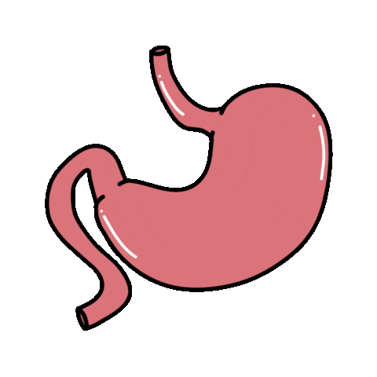

```{r}
#| context: setup

library(tidyverse)
library(ggplot2)
library(shadowtext)
library(colorspace)
library(ggspatial)
library(sf)
library(shiny)
library(plotly)
library(patchwork)
library(ggiraph)

shiny::addResourcePath("media", "media")

# ── Dados ──────────────────────────────────────────────────────────────────────
df <- readxl::read_xlsx("data/MortalidadeCancer.xlsx") |> 
  filter(Cancer == "Câncer de Estomago") |> 
  mutate(codigo = case_when(
    local == "Centro-Oeste" ~ 5,
    local == "Sudeste"      ~ 3,
    local == "Sul"          ~ 4,
    .default = codigo
  ))

shapes <- readRDS("data/shapes.rds")

shape_rj <- readRDS("data/shape_rj.rds")

# ── Constantes ─────────────────────────────────────────────────────────────────
ESTADOS <- c(
  "Acre", "Alagoas", "Amapá", "Amazonas", "Bahia", "Ceará",
  "Distrito Federal", "Espírito Santo", "Goiás", "Maranhão",
  "Mato Grosso", "Mato Grosso do Sul", "Minas Gerais", "Pará",
  "Paraíba", "Paraná", "Pernambuco", "Piauí", "Rio de Janeiro (Estado)",
  "Rio Grande do Norte", "Rio Grande do Sul", "Rondônia", "Roraima",
  "Santa Catarina", "São Paulo", "Sergipe", "Tocantins"
)

REGIOES <- c("Norte", "Nordeste", "Centro-Oeste", "Sudeste", "Sul")

NIVEIS_FAIXA <- c(
  "0-4 anos", "5-9 anos", "10-14 anos", "15-19 anos",
  "20-24 anos", "25-29 anos", "30-34 anos", "35-39 anos",
  "40-44 anos", "45-49 anos", "50-54 anos", "55-59 anos",
  "60-64 anos", "65-69 anos", "70-74 anos", "75-79 anos", "80-mais"
)

LABELS_FAIXA <- c(
  "0-4", "5-9", "10-14", "15-19",
  "20-24", "25-29", "30-34", "35-39",
  "40-44", "45-49", "50-54", "55-59",
  "60-64", "65-69", "70-74", "75-79", "80+"
)
```

# Contexto

## Coluna 1 {.sidebar width="30%"}

::: {style="text-align: center; font-size: 0.88rem; font-weight: 700; text-transform: uppercase; letter-spacing: 0.06em; color: #ae8b2d; border-bottom: 1px solid #ae8b2d44; padding-bottom: 0.4rem; margin-bottom: 0.75rem;"}
O que é o Câncer de Estômago?
:::

Surge quando células da parede do estômago crescem de forma descontrolada.

Por raramente causar sintomas no início, costuma ser descoberto apenas em fases avançadas — o que torna o **diagnóstico precoce** um fator decisivo para as chances de cura.

Código CID-10: `C16` — Neoplasia maligna do estômago

::: {style="text-align: center;"}
{width="60%"}
:::

::: sidebar-footer
Fonte: OMS · INCA · SIM/DATASUS · `{microdatasus}`
:::

## Coluna 2 {.tabset width="70%"}

### Estatísticas

#### Linha 1 {height="40%"}

```{r}
#| component: valuebox
#| title: "Óbitos em 2024"

total <- df |>
  filter(
    local == "Brasil",
    ano == 2024,
    faixa == "todas as idades",
    sexo == "Ambos") |>
  pull(n)

list(value = total, icon = "shield-exclamation", color = "red")
```

```{r}
#| component: valuebox
#| title: "Variação da Taxa 2001-2024"

taxa_2001 <- df |>
  filter(
    local == "Brasil",
    ano == 2001,
    faixa == "todas as idades",
    sexo == "Ambos"
  ) |>
  mutate(taxa = (n/populacao) * 100000) |>
  pull(taxa)

taxa_2024 <- df |>
  filter(
    local == "Brasil",
    ano == 2024,
    faixa == "todas as idades",
    sexo == "Ambos"
  ) |>
  mutate(taxa = (n/populacao) * 100000) |>
  pull(taxa)

variacao <- 100 * (taxa_2024 - taxa_2001) / taxa_2001

list(
  value = paste0(round(variacao, 1), "%"),
  icon  = "graph-up-arrow",
  color = "purple"
)
```

```{r}
#| component: valuebox
#| title: "Região com Maior Taxa em 2024"

regiao <- df |>
  filter(
    local %in% REGIOES,
    ano == 2024,
    faixa == "todas as idades",
    sexo == "Ambos") |>
  mutate(taxa = (n / populacao) * 100000) |>
  slice_max(taxa, n = 1)

list(value = regiao$local, icon = "geo-alt", color = "teal")
```

```{r}
#| component: valuebox
#| title: "Sexo de Maior Mortalidade em 2024"

sexo <- df |>
  filter(
    local == "Brasil",
    ano == 2024,
    faixa == "todas as idades",
    sexo %in% c("Masculino", "Feminino")) |>
  group_by(sexo) |>
  summarise(obitos = sum(n)) |>
  slice_max(obitos, n = 1)

list(value = sexo$sexo, icon = "person-fill", color = "#2196F3")
```

#### Linha 2 {height="60%"}

```{r}
#| context: server

output$serie_br <- renderPlot({
  df |>
    filter(
      local == "Brasil",
      faixa == "todas as idades",
      sexo == "Ambos") |>
    ggplot(aes(x = ano, y = n)) +
    geom_line(aes(color = "Observado"), linewidth = 1.2) +
    geom_point(aes(color = "Observado"), size = 2, alpha = 0.8) +
    geom_smooth(
      method   = "loess", se = FALSE,
      aes(color = "Tendência (LOESS)"),
      linetype = "dashed", linewidth = 0.8
    ) +
    annotate("rect",
      xmin = 2020, xmax = 2022, ymin = -Inf, ymax = Inf,
      alpha = 0.08, fill = "gray70"
    ) +
    annotate("text",
      x = 2021, y = 11000, label = "COVID-19",
      size = 3, color = "gray40", fontface = "italic"
    ) +
    scale_x_continuous(breaks = seq(2001, 2024, by = 3), expand = c(0, 0.5)) +
    scale_y_continuous(labels = function(x) paste0(x / 1000, "mil"))+
    scale_color_manual(
      name   = NULL,
      values = c("Observado" = "#2c3e50", "Tendência (LOESS)" = "#f39c12")
    ) +
    labs(
      title    = "Total de Óbitos no Brasil",
      subtitle = "Evolução anual (2001–2024) | Todas as idades, ambos os sexos",
      x = NULL, y = NULL
    ) +
    theme_minimal(base_size = 12) +
    theme(
      plot.title           = element_text(face = "bold", size = 15, hjust = 0.5),
      plot.subtitle        = element_text(color = "gray40", hjust = 0.5),
      plot.caption         = element_text(color = "gray50", size = 8, hjust = 1),
      panel.grid.major.y   = element_line(color = "gray90", linewidth = 0.4),
      panel.grid.major.x   = element_blank(),
      panel.grid.minor     = element_blank(),
      axis.ticks.x         = element_line(color = "gray70"),
      axis.text            = element_text(color = "gray30"),
      plot.margin          = margin(10, 15, 10, 10),
      legend.position      = c(0, 1),
      legend.justification = c(0, 1)
    )
})
```

```{r}
#| expandable: true
#| out-width: "100%"

plotOutput("serie_br", width = "100%")
```

### Fatores Epidemiológicos

#### Linha 1 {height="40%"}

##### Coluna 1 {width="50%"}

::: {style="text-align: center; border-bottom: 1px solid #ae8b2d44; padding-bottom: 0.4rem; margin-bottom: 0.75rem;"}
[Onde o tumor se desenvolve]{style="font-size: 0.78rem; font-weight: 700; text-transform: uppercase; letter-spacing: 0.08em; color: #ae8b2d !important;"}
:::

::: {style="border-left: 3px solid #ae8b2d; padding-left: 0.75rem; margin-bottom: 0.5rem; font-size: 0.86rem;"}
**Parede interna do estômago** — onde o tumor tem origem
:::

::: {style="border-left: 3px solid #c0392b; padding-left: 0.75rem; margin-bottom: 0.5rem; font-size: 0.86rem;"}
**Gânglios linfáticos** — primeira via de espalhamento
:::

::: {style="border-left: 3px solid #52515e; padding-left: 0.75rem; margin-bottom: 0.5rem; font-size: 0.86rem;"}
**Fígado · Peritônio · Pulmões** — órgãos atingidos em estágios avançados
:::

##### Coluna 2 {width="50%"}

::: {style="text-align: center; border-bottom: 1px solid #ae8b2d44; padding-bottom: 0.4rem; margin-bottom: 0.75rem;"}
[Sinais de alerta]{style="font-size: 0.78rem; font-weight: 700; text-transform: uppercase; letter-spacing: 0.08em; color: #ae8b2d !important;"}
:::

::::::::: {style="display: grid; grid-template-columns: 1fr 1fr; gap: 0.4rem;"}
::: {style="background: #f7f6f2; border-radius: 5px; padding: 0.4rem 0.7rem; font-size: 0.83rem; border-left: 2px solid #ae8b2d44;"}
Dor no estômago
:::

::: {style="background: #f7f6f2; border-radius: 5px; padding: 0.4rem 0.7rem; font-size: 0.83rem; border-left: 2px solid #ae8b2d44;"}
Estômago cheio
:::

::: {style="background: #f7f6f2; border-radius: 5px; padding: 0.4rem 0.7rem; font-size: 0.83rem; border-left: 2px solid #ae8b2d44;"}
Perda de peso
:::

::: {style="background: #f7f6f2; border-radius: 5px; padding: 0.4rem 0.7rem; font-size: 0.83rem; border-left: 2px solid #ae8b2d44;"}
Náuseas frequentes
:::

::: {style="background: #f7f6f2; border-radius: 5px; padding: 0.4rem 0.7rem; font-size: 0.83rem; border-left: 2px solid #ae8b2d44;"}
Dificuldade de engolir
:::

::: {style="background: #f7f6f2; border-radius: 5px; padding: 0.4rem 0.7rem; font-size: 0.83rem; border-left: 2px solid #ae8b2d44;"}
Sangramento digestivo
:::
:::::::::

#### Linha 2 {height="60%"}

##### Coluna 1 {width="50%"}

::: {style="text-align: center; border-bottom: 1px solid #ae8b2d44; padding-bottom: 0.4rem; margin-bottom: 0.75rem;"}
[O que aumenta o risco]{style="font-size: 0.78rem; font-weight: 700; text-transform: uppercase; letter-spacing: 0.08em; color: #ae8b2d !important;"}
:::

- **Bactéria *H. pylori*** — principal causa conhecida
- **Dieta** — excesso de sal, alimentos defumados e embutidos
- **Tabagismo** — eleva o risco em cerca de 60%
- **Álcool** — associação moderada com o desenvolvimento
- **Histórico familiar** — parentes de primeiro grau com a doença

##### Coluna 2 {width="50%"}

::: {style="text-align: center; border-bottom: 1px solid #ae8b2d44; padding-bottom: 0.4rem; margin-bottom: 0.75rem;"}
[Como se proteger]{style="font-size: 0.78rem; font-weight: 700; text-transform: uppercase; letter-spacing: 0.08em; color: #ae8b2d !important;"}
:::

:::: {style="display: grid; grid-template-columns: 1fr 1fr; gap: 0.6rem;"}

::: {style="background: #f0f7f0; border-left: 3px solid #27ae60; border-radius: 0 5px 5px 0; padding: 0.6rem 0.9rem; font-size: 0.86rem;"}
[**Prevenção**]{style="display: block; text-align: center;"}

· Tratar a bactéria *H. pylori*  
· Reduzir sal e defumados  
· Parar de fumar
:::

::: {style="background: #f0f4f7; border-left: 3px solid #2980b9; border-radius: 0 5px 5px 0; padding: 0.6rem 0.9rem; font-size: 0.86rem;"}
[**Detecção precoce**]{style="display: block; text-align: center;"}

· Endoscopia para grupos de risco  
· Acompanhamento com histórico familiar  
· Brasil **ainda não tem** rastreamento nacional
:::

::::

# Taxas de Mortalidade

## Coluna 1 {.sidebar width="20%"}

::: {style="display: flex; align-items: center; justify-content: center; text-align: center; font-size: 0.78rem; font-weight: 700; text-transform: uppercase; letter-spacing: 0.08em; color: #ae8b2d; border-top: 1px solid #ae8b2d44; border-bottom: 1px solid #ae8b2d44; padding: 0.6rem 0; margin-bottom: 1rem;"}
Painel de Seleção
:::

```{r}
selectInput(
  "territorio", "Nível Geográfico:",
  choices  = c("Brasil", "Regional", "Estadual"),
  selected = "Brasil"
)
```

---

```{r}
sliderInput(
  "ano", "Ano:",
  min = 2001, max = 2024, value = 2024, sep = "", width = "100%"
)

actionButton(
  "play", label = NULL,
  icon  = icon("play"),
  style = "width:100%; margin-top:4px;"
)

```

```{r}
#| context: server

# estado do botão: tocando ou pausado
playing <- reactiveVal(FALSE)

observeEvent(input$play, {
  playing(!playing())
  
  # troca o ícone
  if (playing()) {
    updateActionButton(session, "play", icon = icon("pause"))
  } else {
    updateActionButton(session, "play", icon = icon("play"))
  }
})

# timer que dispara a cada 1 segundo quando playing == TRUE
autoplay <- reactiveTimer(1000)

observe({
  autoplay()
  req(playing())
  
  ano_atual <- isolate(input$ano)
  
  if (ano_atual < 2024) {
    updateSliderInput(session, "ano", value = ano_atual + 1)
  } else {
    # chegou no fim — pausa e volta o ícone
    playing(FALSE)
    updateActionButton(session, "play", icon = icon("play"))
  }
})
```

---

Pirâmide Etária

```{r}
selectInput(
  "local", "Local:",
  choices  = c("Brasil", REGIOES),
  selected = "Brasil"
)
```

::: sidebar-footer
Fonte: SIM/DATASUS · `{microdatasus}`
:::

## Coluna 2 {.tabset width="80%"}

### Espacial

#### Linha1 {height="50%"}

##### Coluna 1 {width="50%"}

```{r}
#| context: server

output$barras <- renderPlot({

  territorio <- switch(input$territorio,
    "Estadual" = ESTADOS,
    "Regional" = REGIOES,
    "Brasil"   = "Brasil"
  )

  df_plot <- df |>
    filter(
      local %in% territorio,
      ano   == input$ano,
      sexo  == "Ambos",
      faixa == "todas as idades"
    ) |>
    mutate(
      taxa  = (n / populacao) * 100000,
      local = reorder(local, taxa)
    )

  taxa_max <- max(df_plot$taxa)

  ggplot(df_plot, aes(x = local, y = taxa, fill = taxa)) +
    geom_col(width = 0.7) +
    shadowtext::geom_shadowtext(
      aes(label = round(taxa, 1), y = taxa - taxa_max * 0.02),
      hjust      = 1.15,
      color      = "white",
      bg.color   = "#1e293b",
      bg.r       = 0.1,
      fontface   = "bold",
      size       = 3.2
    ) +
    scale_fill_gradientn(
      colors   = c("#fff1f1", "#fca5a5", "#ef4444", "#b91c1c", "#7f1d1d"),
      name     = "Taxa por\n100 mil hab."
    ) +
    scale_y_continuous(
      expand = expansion(mult = c(0, 0.08)),
      labels = scales::number_format(accuracy = 0.1)
    ) +
    coord_flip(clip = "off") +
    labs(
      title = glue::glue("{input$territorio} · {input$ano}"),
      x     = NULL,
      y     = "Taxa por 100 mil habitantes"
    ) +
    theme_minimal(base_size = 11) +
    theme(
      plot.title          = element_text(face = "bold", size = 11,
                                         color = "#1e293b", hjust = 0.5,
                                         margin = margin(b = 8)),
      plot.title.position = "plot",
      plot.margin         = margin(8, 16, 8, 8),
      panel.grid.major.y  = element_blank(),
      panel.grid.major.x  = element_line(color = "#e2e8f0", linewidth = 0.5),
      panel.grid.minor    = element_blank(),
      axis.text.y         = element_text(size = 9, color = "#334155",
                                         face = "bold"),
      axis.text.x         = element_text(size = 8, color = "#64748b"),
      axis.title.x        = element_text(size = 8, color = "#64748b",
                                         margin = margin(t = 6)),
      axis.ticks          = element_blank(),
      legend.position     = "none"
    )
})
```

```{r}
#| expandable: true
#| out-width: "100%"

plotOutput("barras", width = "100%")
```

##### Coluna 2 {width="50%"}

```{r}
#| context: server

output$mapa_br <- renderPlot({

  territorio <- switch(input$territorio,
    "Estadual" = ESTADOS,
    "Regional" = REGIOES,
    "Brasil"   = "Brasil"
  )

  codigos_contorno <- switch(input$territorio,
    "Brasil"   = integer(0),
    "Regional" = 1:5,
    "Estadual" = unique(shapes$codigo[!shapes$codigo %in% 0:5])
  )

  df_mapa <- shapes |>
    right_join(
      df |>
        filter(
          local %in% territorio,
          ano   == input$ano,
          sexo  == "Ambos",
          faixa == "todas as idades"
        ) |>
        mutate(taxa = (n / populacao) * 100000),
      by = "codigo"
    )

  ggplot() +
    geom_sf(
      data  = df_mapa,
      aes(fill = taxa, geometry = geometry),
      color = "white", linewidth = 0.15
    ) +
    geom_sf(
      data = shapes |> filter(codigo %in% codigos_contorno),
      fill = NA, color = "#94a3b8", linewidth = 0.3
    ) +
    geom_sf(
      data = shapes |> filter(codigo == 0),
      fill = NA, color = "#1e293b", linewidth = 0.8
    ) +
    scale_fill_gradientn(
      colors   = c("#fff1f1", "#fca5a5", "#ef4444", "#b91c1c", "#7f1d1d"),
      na.value = "#e2e8f0",
      name     = "Taxa por\n100 mil hab.",
      guide    = guide_colorbar(
        barwidth        = unit(0.35, "cm"),
        barheight       = unit(4, "cm"),
        ticks           = FALSE,
        frame.colour    = "#cbd5e1",
        frame.linewidth = 0.4,
        title.hjust     = 0.5,
        title.theme     = element_text(size = 6.5, color = "#334155",
                                       face = "bold", lineheight = 1.4),
        label.theme     = element_text(size = 6.5, color = "#64748b")
      )
    ) +
    annotation_north_arrow(
      location    = "bl", which_north = "true",
      pad_x = unit(0.4, "cm"), pad_y = unit(0.4, "cm"),
      style = north_arrow_fancy_orienteering(
        text_col  = "#334155", line_col = "#334155",
        fill      = c("#b91c1c", "#f8fafc"), text_size = 6
      ),
      height = unit(1.0, "cm"), width = unit(1.0, "cm")
    ) +
    annotation_scale(
      location = "br", width_hint = 0.2,
      text_cex = 0.5, line_width = 0.5,
      text_col = "#64748b", line_col = "#94a3b8"
    ) +
    labs(title = glue::glue("{input$territorio} · {input$ano}")) +
    theme_void(base_size = 11) +
    theme(
      plot.title.position  = "plot",
      plot.title           = element_text(face = "bold", size = 10,
                                          color = "#1e293b", hjust = 0.5,
                                          margin = margin(b = 4)),
      plot.margin          = margin(8, 48, 8, 8),
      legend.position      = "right",
      legend.justification = "center",
      legend.margin        = margin(0, 0, 0, 4)
    )
})
```

```{r}
#| padding: 0

plotOutput("mapa_br", width = "100%", height = "100%", fill = TRUE)
```

#### Linha2 {height="50%"}

```{r}
#| context: server

output$serie <- renderPlotly({

  territorio <- switch(input$territorio,
    "Estadual" = ESTADOS,
    "Regional" = REGIOES,
    "Brasil"   = "Brasil"
  )

  df_plot <- df |>
    filter(
      local %in% territorio,
      faixa == "todas as idades",
      sexo  == "Ambos"
    ) |>
    mutate(taxa = (n / populacao) * 100000)

  # ── Cores base por região ───────────────────────────────────────────────────
  COR_REGIAO <- c(
    "Norte"        = "#2e7d32",
    "Nordeste"     = "#e65100",
    "Centro-Oeste" = "#6a1b9a",
    "Sudeste"      = "#1565c0",
    "Sul"          = "#ad1457"
  )

  ESTADO_REGIAO <- c(
    "Acre"                    = "Norte",
    "Amapá"                   = "Norte",
    "Amazonas"                = "Norte",
    "Pará"                    = "Norte",
    "Rondônia"                = "Norte",
    "Roraima"                 = "Norte",
    "Tocantins"               = "Norte",
    "Alagoas"                 = "Nordeste",
    "Bahia"                   = "Nordeste",
    "Ceará"                   = "Nordeste",
    "Maranhão"                = "Nordeste",
    "Paraíba"                 = "Nordeste",
    "Pernambuco"              = "Nordeste",
    "Piauí"                   = "Nordeste",
    "Rio Grande do Norte"     = "Nordeste",
    "Sergipe"                 = "Nordeste",
    "Distrito Federal"        = "Centro-Oeste",
    "Goiás"                   = "Centro-Oeste",
    "Mato Grosso"             = "Centro-Oeste",
    "Mato Grosso do Sul"      = "Centro-Oeste",
    "Espírito Santo"          = "Sudeste",
    "Minas Gerais"            = "Sudeste",
    "Rio de Janeiro (Estado)" = "Sudeste",
    "São Paulo"               = "Sudeste",
    "Paraná"                  = "Sul",
    "Rio Grande do Sul"       = "Sul",
    "Santa Catarina"          = "Sul"
  )

  # ── Gera paleta ─────────────────────────────────────────────────────────────
  cores_locais <- if (input$territorio == "Brasil") {

    c("Brasil" = "#1e293b")

  } else if (input$territorio == "Regional") {

    COR_REGIAO[names(COR_REGIAO) %in% unique(df_plot$local)]

  } else {
    locais <- unique(df_plot$local)
    unlist(lapply(names(COR_REGIAO), function(reg) {
      estados_reg <- locais[ESTADO_REGIAO[locais] == reg]
      if (length(estados_reg) == 0) return(NULL)
      tons <- colorRampPalette(c(COR_REGIAO[reg], colorspace::lighten(COR_REGIAO[reg], 0.65)))(length(estados_reg))
      setNames(tons, estados_reg)
    }))
  }

  # ── Reordena local por região para a legenda ─────────────────────────────────
  if (input$territorio == "Estadual") {
    ordem <- unlist(lapply(names(COR_REGIAO), function(reg) {
      sort(names(ESTADO_REGIAO)[ESTADO_REGIAO == reg])
    }))
    # mantém só os que estão no df
    ordem <- ordem[ordem %in% unique(df_plot$local)]

    df_plot <- df_plot |>
      mutate(local = factor(local, levels = ordem))

  } else if (input$territorio == "Regional") {
    df_plot <- df_plot |>
      mutate(local = factor(local, levels = names(COR_REGIAO)))
  }

  n_locais <- n_distinct(df_plot$local)

  p <- ggplot(df_plot, aes(x = ano, y = taxa, color = local, group = local)) +
    geom_line(linewidth = 1.1, alpha = 0.9) +
    geom_point(size = 1.8, alpha = 0.75) +
    geom_smooth(
      method   = "loess", se = FALSE,
      linetype = "dashed", linewidth = 0.7, alpha = 0.6
    ) +
    annotate("rect",
      xmin = 2020, xmax = 2022, ymin = -Inf, ymax = Inf,
      alpha = 0.08, fill = "gray70"
    ) +
    annotate("text",
      x = 2021, y = Inf, label = "COVID-19",
      vjust = 1.5, size = 3, color = "gray40", fontface = "italic"
    ) +
    geom_vline(
      xintercept = input$ano,
      color = "#ae8b2d", linewidth = 0.8, linetype = "dashed", alpha = 0.7
    ) +
    annotate("text",
      x     = input$ano, y = Inf,
      label = input$ano,
      vjust = 2.5, size = 3,
      color = "#ae8b2d", fontface = "bold"
    ) +
    scale_x_continuous(breaks = seq(2001, 2024, by = 3), expand = c(0, 0.5)) +
    scale_y_continuous(labels = scales::comma) +
    scale_color_manual(values = cores_locais, name = NULL) +
    labs(
      title = "Taxa de Mortalidade por 100 mil habitantes",
      x = NULL, y = NULL
    ) +
    theme_minimal(base_size = 12) +
    theme(
      plot.title         = element_text(hjust = 0.5),
      panel.grid.major.y = element_line(color = "gray90", linewidth = 0.4),
      panel.grid.major.x = element_blank(),
      panel.grid.minor   = element_blank(),
      axis.ticks.x       = element_line(color = "gray70"),
      axis.text          = element_text(color = "gray30"),
      plot.margin        = margin(10, 15, 10, 10),
      legend.position    = if (n_locais == 1) "none" else "right",
      legend.text        = element_text(size = 9)
    )

  plotly::ggplotly(p)
})
```

```{r}
#| expandable: true

plotlyOutput("serie", width = "100%")
```

### Etário

```{r}
#| context: server

output$piramide <- renderPlot({

  df_plot <- df |>
    filter(
      local  == input$local,
      ano    == input$ano,
      faixa  != "todas as idades",
      sexo   != "Ambos"
    ) |>
    mutate(
      idade_rotulada = factor(
        faixa, levels = NIVEIS_FAIXA, labels = LABELS_FAIXA
      ),
      taxa = (n/populacao) * 100000
    )

  lim_x <- df |>
    filter(
      local  == input$local,
      faixa  != "todas as idades",
      sexo   != "Ambos"
    ) |>
    mutate(taxa = (n / populacao) * 100000) |>
    summarise(max_taxa = max(taxa, na.rm = TRUE)) |>
    pull(max_taxa) * 1.08

  breaks_x <- pretty(c(0, lim_x), n = 5)

  theme_piramide <- theme_minimal(base_size = 12) +
    theme(
      axis.text.y        = element_blank(),
      axis.ticks.y       = element_blank(),
      axis.text.x        = element_text(color = "gray50", size = 9),
      panel.grid.major.y = element_blank(),
      panel.grid.minor   = element_blank()
    )

  p_masc <- df_plot |>
    filter(sexo == "Masculino") |>
    ggplot(aes(x = taxa, y = idade_rotulada)) +
    geom_bar(stat = "identity", width = 0.75, fill = "#2196F3", alpha = 0.92) +
    geom_text(aes(label = round(taxa, 1)), hjust = 1.25, size = 2.8,
          color = "white", fontface = "bold") +
    geom_text(
      aes(x = taxa, label = round(taxa, 1)),
      hjust    = 1.4,
      size     = 2.6,
      color    = "gray60",
      fontface = "plain"
    ) +
    scale_x_reverse(
      breaks = breaks_x, labels = breaks_x,
      limits = c(lim_x, 0),
      expand = expansion(mult = c(0.02, 0))
    ) +
    labs(title = "Masculino", x = NULL, y = NULL) +
    theme_piramide +
    theme(
      plot.title  = element_text(face = "bold", hjust = 0.5,
                                 color = "#2196F3", size = 13),
      plot.margin = margin(5, 0, 5, 10)
    )

  p_centro <- distinct(df_plot, idade_rotulada) |>
    ggplot(aes(x = 0.5, y = idade_rotulada)) +
    geom_text(aes(label = idade_rotulada),
              color = "#333333", size = 2.9, fontface = "bold") +
    scale_x_continuous(limits = c(0, 1), expand = c(0, 0)) +
    labs(title = "Idade", x = NULL, y = NULL) +
    theme_void() +
    theme(
      plot.title  = element_text(face = "bold", hjust = 0.5,
                                 color = "gray40", size = 13),
      plot.margin = margin(5, 2, 5, 2)
    )

  p_fem <- df_plot |>
    filter(sexo == "Feminino") |>
    ggplot(aes(x = taxa, y = idade_rotulada)) +
    geom_bar(stat = "identity", width = 0.75, fill = "#E91E63", alpha = 0.92) +
    geom_text(aes(label = round(taxa, 1)), hjust = -0.25, size = 2.8,
          color = "white", fontface = "bold") +
    geom_text(
      aes(x = taxa, label = round(taxa, 1)),
      hjust    = -0.4,
      size     = 2.6,
      color    = "gray60",
      fontface = "plain"
    ) +
    scale_x_continuous(
      breaks = breaks_x, labels = breaks_x,
      limits = c(0, lim_x),
      expand = expansion(mult = c(0, 0.02))
    ) +
    labs(title = "Feminino", x = NULL, y = NULL) +
    theme_piramide +
    theme(
      plot.title  = element_text(face = "bold", hjust = 0.5,
                                 color = "#E91E63", size = 13),
      plot.margin = margin(5, 10, 5, 0)
    )

  (p_masc | p_centro | p_fem) +
    plot_annotation(
      title    = "Taxa de Mortalidade por 100 mil Habitantes",
      subtitle = glue::glue("{input$local} · {input$ano}"),
      theme    = theme(
        plot.title    = element_text(face = "bold", hjust = 0.5, size = 17),
        plot.subtitle = element_text(hjust = 0.5, color = "gray50", size = 10)
      )
    ) +
    plot_layout(widths = c(5, 1.3, 5))
})
```

```{r}
#| expandable: true

plotOutput("piramide", width = "100%")
```

# Rio de Janeiro

## Coluna 1 {.sidebar width="20%"}

::: {style="display: flex; align-items: center; justify-content: center; text-align: center; font-size: 0.78rem; font-weight: 700; text-transform: uppercase; letter-spacing: 0.08em; color: #ae8b2d; border-top: 1px solid #ae8b2d44; border-bottom: 1px solid #ae8b2d44; padding: 0.6rem 0; margin-bottom: 1rem;"}
Painel de Seleção
:::

```{r}
selectInput(
  "muni", "Município:",
  choices = list(
    "Estado" = list("Rio de Janeiro (Estado)" = "Rio de Janeiro (Estado)"),
    "Municípios" = as.list(setNames(
      unique(df$local[!df$local %in% c(ESTADOS, REGIOES, "Brasil")]),
      unique(df$local[!df$local %in% c(ESTADOS, REGIOES, "Brasil")])
    ))
  ),
  selected = "Rio de Janeiro (Estado)"
)
```

---

```{r}
sliderInput(
  "ano_rj", "Ano:",
  min   = 2001,
  max   = 2024,
  value = 2024,
  sep   = "",
  width = "100%"
)

actionButton(
  "play_rj", label = NULL,
  icon  = icon("play"),
  style = "width:100%; margin-top:4px;"
)

```

```{r}
#| context: server

playing_rj <- reactiveVal(FALSE)

observeEvent(input$play_rj, {
  playing_rj(!playing_rj())
  
  if (playing_rj()) {
    updateActionButton(session, "play_rj", icon = icon("pause"))
  } else {
    updateActionButton(session, "play_rj", icon = icon("play"))
  }
})

autoplay_rj <- reactiveTimer(1000)

observe({
  autoplay_rj()
  req(playing_rj())
  
  ano_atual <- isolate(input$ano_rj)
  
  if (ano_atual < 2024) {
    updateSliderInput(session, "ano_rj", value = ano_atual + 1)
  } else {
    playing_rj(FALSE)
    updateActionButton(session, "play_rj", icon = icon("play"))
  }
})
```

::: sidebar-footer
Fonte: SIM/DATASUS · `{microdatasus}`
:::

## Coluna 2 {width="80%"}

### Linha 1 {height="50%"}

##### Coluna 1 {height="50%"}

```{r}
#| context: server

card_style <- function(bg) {
  glue::glue(
    "background:{bg}; color:white; border-radius:8px;
     padding:12px 16px; height:100%; display:flex;
     flex-direction:column; justify-content:center;"
  )
}

output$vbox_obitos_rj <- renderUI({
  total <- df |>
    filter(local == input$muni, ano == input$ano_rj,
           faixa == "todas as idades", sexo == "Ambos") |>
    pull(n)

  div(style = card_style("#dc2626"),
    div(style = "font-size:0.85rem; opacity:0.9; margin-bottom:4px;",
        bsicons::bs_icon("shield-exclamation"), " Óbitos"),
    div(style = "font-size:1.8rem; font-weight:bold; line-height:1.2;",
        scales::number(total, big.mark = ".", decimal.mark = ",")),
    div(style = "font-size:0.72rem; opacity:0.75; margin-top:4px;",
    "Ambos os sexos · todas as idades")
  )
})

output$vbox_masc_rj <- renderUI({
  total <- df |>
    filter(local == input$muni, ano == input$ano_rj,
           faixa == "todas as idades", sexo == "Masculino") |>
    pull(n)

  div(style = card_style("#2196F3"),
    div(style = "font-size:0.85rem; opacity:0.9; margin-bottom:4px;",
        bsicons::bs_icon("person-fill"), " Óbitos Masculinos"),
    div(style = "font-size:1.8rem; font-weight:bold; line-height:1.2;",
        scales::number(total, big.mark = ".", decimal.mark = ",")),
    div(style = "font-size:0.72rem; opacity:0.75; margin-top:4px;",
    "todas as idades")
  )
})

output$vbox_pop_rj <- renderUI({
  total <- df |>
    filter(local == input$muni, ano == input$ano_rj,
           faixa == "todas as idades", sexo == "Ambos") |>
    pull(populacao)

  div(style = card_style("#0e7490"),
    div(style = "font-size:0.85rem; opacity:0.9; margin-bottom:4px;",
        bsicons::bs_icon("people-fill"), " População"),
    div(style = "font-size:1.8rem; font-weight:bold; line-height:1.2;",
        scales::number(total, big.mark = ".", decimal.mark = ",")),
    div(style = "font-size:0.72rem; opacity:0.75; margin-top:4px;",
        "Ambos os sexos · todas as idades")
  )
})

output$vbox_fem_rj <- renderUI({
  total <- df |>
    filter(local == input$muni, ano == input$ano_rj,
           faixa == "todas as idades", sexo == "Feminino") |>
    pull(n)

  div(style = card_style("#E91E63"),
    div(style = "font-size:0.85rem; opacity:0.9; margin-bottom:4px;",
        bsicons::bs_icon("person-fill"), " Óbitos Femininos"),
    div(style = "font-size:1.8rem; font-weight:bold; line-height:1.2;",
        scales::number(total, big.mark = ".", decimal.mark = ",")),
    div(style = "font-size:0.72rem; opacity:0.75; margin-top:4px;",
        "todas as idades")
  )
})
```

##### Coluna 1 {height="50%"}

```{r}
uiOutput("vbox_obitos_rj")
```

```{r}
uiOutput("vbox_masc_rj")
```

##### Coluna 2 {height="50%"}

```{r}
uiOutput("vbox_pop_rj")
```

```{r}
uiOutput("vbox_fem_rj")
```

#### Coluna 2 {width="50%"}

```{r}
#| context: server

output$mapa_rj <- renderGirafe({
  df_mapa_rj <- shape_rj |>
    left_join(
      df |>
        filter(
          ano   == input$ano_rj,
          sexo  == "Ambos",
          faixa == "todas as idades"
        ) |>
        mutate(taxa = (n / populacao) * 100000),
      by = "codigo"
    )

  plot_mapa_rj <- ggplot() +
    geom_sf_interactive(
      data = df_mapa_rj,
      aes(
        fill    = taxa,
        geometry = geometry,
        tooltip = paste0("<b>", local, "</b><br>Taxa: ", round(taxa, 1), " por 100 mil"),
        data_id = codigo
      ),
      color = "white", linewidth = 0.15
    ) +
    geom_sf(
      data = shape_rj,
      fill = NA, color = "#94a3b8", linewidth = 0.3
    ) +
    geom_sf(
      data = shapes |> filter(codigo == 33),
      fill = NA, color = "#1e293b", linewidth = 0.8
    ) +
    scale_fill_gradientn(
      colors   = c("#fff1f1", "#fca5a5", "#ef4444", "#b91c1c", "#7f1d1d"),
      na.value = "#e2e8f0",
      name     = "Taxa por\n100 mil hab.",
      guide    = guide_colorbar(
        barwidth        = unit(0.5, "cm"),
        barheight       = unit(7, "cm"),
        ticks           = FALSE,
        frame.colour    = "#cbd5e1",
        frame.linewidth = 0.4,
        title.hjust     = 0.5,
        title.theme     = element_text(size = 9, color = "#334155",
                                      face = "bold", lineheight = 1.4),
        label.theme     = element_text(size = 12, color = "#64748b")
      )
    ) +
    annotation_north_arrow(
      location    = "tl", which_north = "true",
      pad_x = unit(0.4, "cm"), pad_y = unit(0.4, "cm"),
      style = north_arrow_fancy_orienteering(
        text_col  = "#334155", line_col = "#334155",
        fill      = c("#b91c1c", "#f8fafc"), text_size = 6
      ),
      height = unit(2.0, "cm"), width = unit(2.0, "cm")
    ) +
    annotation_scale(
      location = "br", width_hint = 0.2,
      text_cex = 0.5, line_width = 0.5,
      text_col = "#64748b", line_col = "#94a3b8"
    ) +
    labs(title = glue::glue("Rio de Janeiro · {input$ano_rj}")) +
    theme_void(base_size = 11) +
    theme(
      plot.title.position  = "plot",
      plot.title           = element_text(face = "bold", size = 10,
                                          color = "#1e293b", hjust = 0.5,
                                          margin = margin(b = 4)),
      plot.margin          = margin(4, 8, 4, 4),
      legend.position      = "right",
      legend.justification = "center",
      legend.margin        = margin(0, 0, 0, 2)
    )

  girafe(
    ggobj      = plot_mapa_rj,
    width_svg  = 9,
    height_svg = 9,
    options = list(
      opts_hover(css = "fill-opacity:0.75; stroke:#1e293b; stroke-width:1.5px;"),
      opts_hover_inv(css = "fill-opacity:0.2;"),
      opts_tooltip(
        css       = "background:#1e293b; color:white; padding:6px 10px;
                    border-radius:5px; font-size:12px; line-height:1.5;",
        use_fill  = FALSE,
        delay_mouseout = 500
      ),
      opts_sizing(rescale = TRUE, width = 1)
    )
  )
})
```

```{r}
#| padding: 0

girafeOutput(
  "mapa_rj",
  width  = "100%",
  height = "100vh" 
)
```

### Linha 2 {height="50%"}

```{r}
#| context: server

output$serie_rj <- renderPlot({

  df_serie_rj <- df |>
    filter(
      local %in% input$muni,
      faixa == "todas as idades",
      sexo  == "Ambos"
    ) |>
    mutate(taxa = (n / populacao) * 100000)

  ggplot(df_serie_rj, aes(x = ano, y = taxa)) +
    geom_line(aes(color = "Observado"), linewidth = 1.2) +
    geom_point(aes(color = "Observado"), size = 2, alpha = 0.8) +
    geom_smooth(
      method   = "loess", se = FALSE,
      aes(color = "Tendência (LOESS)"),
      linetype = "dashed", linewidth = 0.8
    ) +
    annotate("rect",
      xmin = 2020, xmax = 2022, ymin = -Inf, ymax = Inf,
      alpha = 0.08, fill = "gray70"
    ) +
    annotate("text",
      x = 2021, y = Inf, label = "COVID-19",
      vjust = 1.5, size = 3, color = "gray40", fontface = "italic"
    ) +
    scale_x_continuous(breaks = seq(2001, 2024, by = 3), expand = c(0, 0.5)) +
    scale_y_continuous(labels = scales::number_format(big.mark = "")) +
    scale_color_manual(
      name   = NULL,
      values = c("Observado" = "#2c3e50", "Tendência (LOESS)" = "#f39c12")
    ) +
    labs(
      title    = glue::glue("Taxa de Mortalidade · {input$muni}"),
      subtitle = "Evolução anual (2001–2024) | Todas as idades, ambos os sexos",
      x = NULL, y = NULL
    ) +
    geom_vline(
      xintercept = input$ano_rj,
      color = "#ae8b2d", linewidth = 0.8, linetype = "dashed", alpha = 0.7
    ) +
    annotate("text",
      x     = input$ano_rj, y = Inf,
      label = input$ano_rj,
      vjust = 2.5, size = 3,
      color = "#ae8b2d", fontface = "bold"
    ) +
    geom_label(
      data = df_serie_rj |> filter(ano == input$ano_rj),
      aes(
        x = ano,
        y = taxa,
        label = sprintf("%.1f", taxa)
      ),
      vjust = -0.8,
      size = 3.5,
      fontface = "bold",
      fill = "#ae8b2d",
      color = "#2c3e50",
      label.size = 0.4,
      label.padding = unit(0.15, "lines")
    ) +
    theme_minimal(base_size = 12) +
    theme(
      plot.title           = element_text(face = "bold", size = 15, hjust = 0.5),
      plot.subtitle        = element_text(color = "gray40", hjust = 0.5),
      panel.grid.major.y   = element_line(color = "gray90", linewidth = 0.4),
      panel.grid.major.x   = element_blank(),
      panel.grid.minor     = element_blank(),
      axis.ticks.x         = element_line(color = "gray70"),
      axis.text            = element_text(color = "gray30"),
      plot.margin          = margin(10, 15, 10, 10),
      legend.position      = "right",
      legend.justification = "center",
    )
})
```

```{r}
#| expandable: true

plotOutput("serie_rj", width = "100%")
```